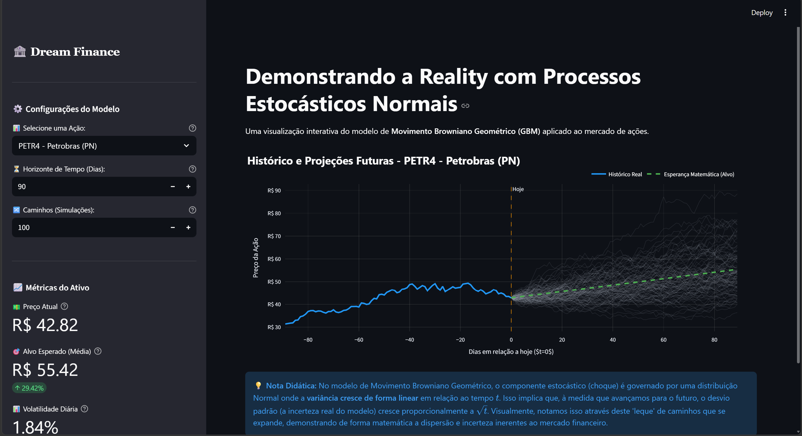
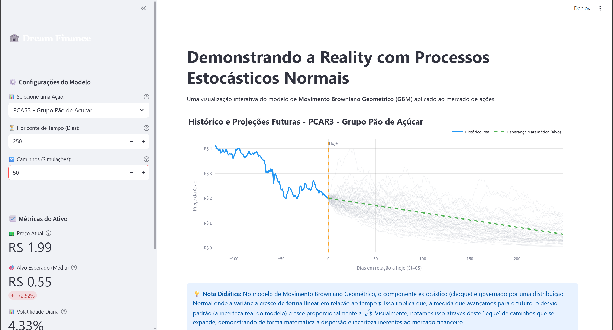

# 🏦 Dream Finance - Simulador Estocástico


> Uma aplicação web interativa desenvolvida com **Streamlit** focada em modelagem financeira e estatística quantitativa. O simulador aplica o conceito de **Movimento Browniano Geométrico (GBM)** para projetar caminhos estocásticos de ativos do mercado real (B3 e internacionais).

---

## 📸 Demonstração da Interface

<p align="center">
  
</p>
<br>
<p align="center">
  
</p>
<p align="center">
  <em>Visualização profissional da plataforma com o histórico real conectado às projeções futuras.</em>
</p>

---

## 🔬 Metodologia: Movimento Browniano Geométrico (GBM)

O modelo estatístico implementado no simulador baseia-se na premissa de que os log-retornos diários de uma ação seguem um passeio aleatório regido por uma distribuição Normal padronizada. 

A matemática fundamental para atualizar o preço do ativo $S$ no tempo $t$ obedece à equação diferencial estocástica abaixo:

$$S_t = S_{t-1} \times \exp\left(\left(\mu - \frac{\sigma^2}{2}\right)dt + \sigma \sqrt{dt} \cdot Z\right)$$

Onde:
- **$S_0$**: Preço Atual (buscado em tempo real da bolsa).
- **$\mu$ (Drift)**: A média do crescimento diário histórico (log-retornos).
- **$\sigma$ (Volatilidade)**: O desvio padrão histórico diário, que representa o Risco daquele ativo.
- **$Z$**: O choque estocástico (incerteza), gerado através de um número aleatório independente advindo de uma Distribuição Normal Padrão $N(0, 1)$.

À medida que o tempo $t$ (em dias) avança, a variância do sistema cresce linearmente em proporção a $t$. Isso visualmente cria a abertura em formato de "leque" (a dispersão dos preços simulados), demonstrando matematicamente que a projeção de longo prazo é substancialmente mais incerta do que a de curto prazo.

A **Esperança Matemática** ou Alvo Médio Esperado ($E[S_T]$) no horizonte de tempo $T$ é renderizada no aplicativo por meio do cálculo: 
$$E[S_T] = S_0 \times \exp\left(\left(\mu + \frac{\sigma^2}{2}\right) T\right)$$

---

## 🚀 Funcionalidades Principais

* **Busca Global em Tempo Real:** Banco de dados listando mais de 60 principais empresas da bolsa brasileira (B3) e americanas (NASDAQ/NYSE), além de permitir um **input manual livre** para pesquisar qualquer *ticker* de qualquer parte do planeta que exista no Yahoo Finance.
* **Interface *Notion-like* Profissional:** Design elegante, sem poluição visual, projetado nativamente para adaptação automática do modo **Light** e **Dark** dependendo da configuração atual do seu navegador/sistema operacional.
* **Motor Estocástico Paralelo:** Geração dinâmica de milhares de caminhos simultâneos otimizada via vetorização usando `numpy`, sem gargalos computacionais ou lentidão de renderização (loops lentos).
* **Histórico Contínuo (Plotly):** Conexão visual interativa e fluída do passado (dados reais de fechamento dos últimos dias equivalentes ao $t$) com os infinitos futuros projetados gerados pelo simulador estatístico.
* **Métricas Dinâmicas:** Cálculo automático das métricas vitais para *pricing* quantitativo e tomada de risco na aba lateral: Volatilidade real, Drift calculado, Preço Alvo projetado e Variação percentual ($\Delta$).

---

## 🛠️ Tecnologias Utilizadas

* **[Python 3.8+](https://www.python.org/):** Linguagem *core* base do processamento quantitativo.
* **[Streamlit](https://streamlit.io/):** Framework inovador e ultra-rápido para construção do Front-end interativo sem uso de HTML/JS complexos.
* **[Plotly Graph Objects](https://plotly.com/python/):** Biblioteca principal de visualização de dados. Fornece ferramentas robustas que permitem alto grau de controle visual em *scatter plots* de múltiplos traços.
* **[YFinance](https://pypi.org/project/yfinance/):** Pacote *wrapper* poderoso em Python utilizado para coleta automatizada dos dados da bolsa diretamente das APIs abertas do Yahoo.
* **[NumPy](https://numpy.org/) e [Pandas](https://pandas.pydata.org/):** Espinha dorsal da manipulação matricial e cálculo vetorial das séries financeiras temporais.

---

## ⚙️ Como executar o projeto localmente

Siga o passo a passo abaixo para rodar a aplicação web em seu próprio computador:

### 1. Pré-requisitos
Certifique-se de que você possui o **Python** instalado em sua máquina e adicionado ao `PATH`.

### 2. Clonando o Repositório
Abra o seu terminal (Prompt de Comando, PowerShell ou Terminal do Linux/Mac) e baixe o código-fonte:
```bash
git clone https://github.com/SeuUsuario/DreamFinance.git
cd DreamFinance
```
*(Lembre-se de substituir `SeuUsuario` pela sua URL final caso faça fork!)*

### 3. Instalando as Dependências
Com o terminal aberto dentro da pasta clonada, execute o comando de instalação para baixar os pacotes necessários pelo `pip`:
```bash
pip install streamlit numpy pandas plotly yfinance
```

### 4. Iniciando o Simulador
Execute o comando de partida do servidor Streamlit em cima do script principal:
```bash
streamlit run simulador_estocastico.py
```

O seu navegador padrão abrirá automaticamente em alguns segundos (normalmente em `http://localhost:8501`) exibindo a interface pronta para cálculos reais.

---

## 🎓 Escopo Acadêmico
O sistema **Dream Finance** foi arquitetado sob exigências analíticas e financeiras estritas. Ele não se baseia em simples previsões irrealistas, mas sim em matemática estocástica rigorosa. É altamente aplicável como material laboratorial, estudo em Finanças Quantitativas, e artefato tecnológico para submissões à bancas universitárias.

---
Feito com ☕, Python e Alta Matemática.
